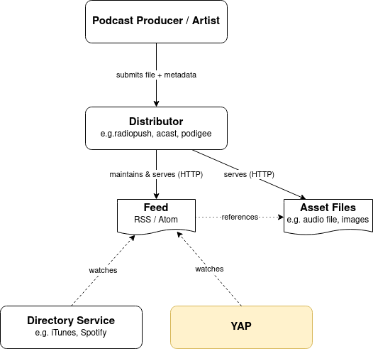

# Yet Another Podcatcher (YAP)

## Main features of this one

 * CLI-based, no graphical user interface
 * Cron-friendly (at least planned to be)
 * Excessive embedding of metadata (and cover art)
 * No re-encoding of downloaded files
 * Merges external tracklist as chapter marks, if requested.

## What does YAP do and how does it work?

First, consider the usual situation for podcast distribution.

The podcast producer/artist sends the audio file to a distribution service, which in turn maintains and provides a feed.
This feed is then monitored by a directory service, the best known of which is iTunes.

YAP essentially also monitors the aforementioned feeds, so it takes the place of a directory service in the diagram.
Here we can benefit from the fact that this is a documented interface, each directory service usually publicly documents how the RSS feed must be structured and extends it using XML namespaces if necessary.

Currently, support for XML extensions is limited to iTunes (`itunes:`).
However, this is not a limitation, since on the one hand practically all podcasts are represented on iTunes and on the other hand it is so widespread that other directory services (such as Spotify) can also handle the iTunes extensions, so they have become a de-facto standard.
Any distributor service will most certainly make the feeds iTunes-compliant, so processing the feeds through YAP is possible in any case.

Therefore, if you want to have YAP monitor a podcast, you need to extract the internal feed URL.
In the case of iTunes, you can have this done automatically using the script `util/itunes-feed-url-extractor.php`.
